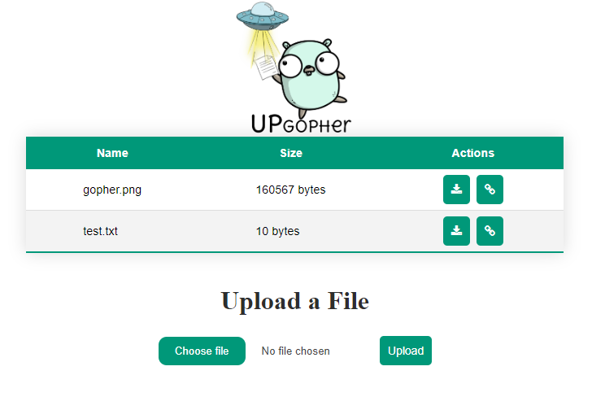

# Upgopher

<p align="center"></p>


This is a simple Go web server that allows users to upload files and view a list of the uploaded files. The server can be run locally or deployed to a remote server.

This project tries to replace all file servers that use python, since there are always problems with libraries. Sometimes we want it to be on a remote pc and go gives you the possibility of cross-platform compilation and to work anywhere...


## Features
* Users can upload files by selecting a file and clicking the "Upload" button
* Uploaded files are stored in the "uploads" directory by default, but the directory can be changed using the -dir flag
* Users can view a list of the uploaded files by visiting the root URL
* Basic authentication is available to restrict access to the server. To use it, set the -user and -pass flags with the desired username and password.
## Usage
To run the server locally:

```bash
git@github.com:wanetty/upgopher.git
cd upgopher
go build cmd/upgopher/upgopher.go 
```


### Help Output:

```bash
./upgopher -h
Usage of ./upgopher:
  -dir string
        directory path (default "./uploads")
  -pass string
        password for authentication
  -port int
        port number (default 9090)
  -user string
        username for authentication
```


## License
This project is licensed under the MIT License. See the LICENSE file for details.
